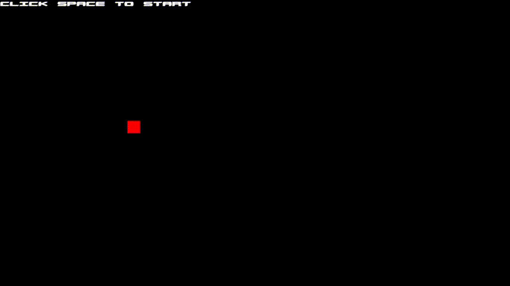

# Square Eater

## What's this?
Square Eater is simple game, designed to sharpen your reflex skills.
It can also provide you epilepsy as well.

## What's going on?
Rules are simple: you are the red square and others squares will resp 
from every direction. If you touch any of them, you loose. 

## Controls
Standard W, S, A and D are your teammates.

## License
This project is licensed under [The MIT License](./LICENSE.md).